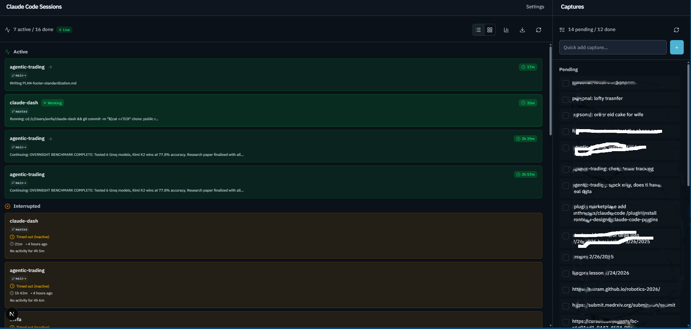

# claude-dash

A local dashboard for Claude Code session tracking. See which sessions are active, what Claude is currently doing, when it needs your input, and manage your idea backlog — all from a browser tab.

**Not a token/cost tracker.** The focus is workflow visibility: knowing when to walk away, when to come back, and what happened while you were gone.



## Features

- **Real-time session status** — Sessions appear within ~200ms via SSE (Server-Sent Events). A pulsing Live badge confirms the connection. Active, paused (needs input), completed, and crashed sessions across all your projects.
- **Tool-level activity** — See exactly what Claude is doing: "Reading route.ts", "Running: pytest", "Editing server.py"
- **Git branch & PR/CI badges** — Each session card shows the current branch, a dirty-state indicator, and a linked PR chip with a passing/failing/pending CI dot. Polled every 30s from your configured project paths.
- **List and kanban views** — Toggle between a grouped list and a 4-column kanban board (Active · Needs Input · Interrupted · Done). Preference is saved across reloads.
- **Push notifications** — Get a Telegram message when Claude needs approval or asks a question, so you can walk away and come back only when needed
- **Session actions** — Dismiss, mark done, add notes directly from the dashboard
- **Crash detection** — Distinguishes clean exits from unexpected crashes
- **Captures/Todos** — Optional: manage a `~/CAPTURES.md` idea backlog alongside your sessions
- **Dispatch tasks from the dashboard** — Send a capture item directly to Claude Code CLI. Tracked with live output streaming, PID, stderr capture, and a "From captures" badge in the sessions panel.
- **Export** — Download session history as JSON or CSV

## How it works

A small hook script (`session-hook.js`) plugs into Claude Code's native hook events — `SessionStart`, `PreToolUse`, `PostToolUse`, `UserPromptSubmit`, `SessionEnd`. It writes a lightweight append log and a few small state files. The dashboard streams updates in real time via SSE: it watches the log file and activity files with `fs.watch`, pushing new data to the browser within ~200ms of any change.

No background daemon. No dependency on Claude's internal log format. No API calls.

## Prerequisites

- [Node.js](https://nodejs.org/) 18+
- [Claude Code CLI](https://claude.ai/code) installed and in use

## Setup

### 1. Install dependencies

```bash
npm install
```

### 2. Set up the hook

Copy the hook script to a directory it will run from. All paths in the hook are relative to wherever you place it, so choose a stable location.

**Option A — recommended (`~/.claude-dash/`):**

```bash
mkdir -p ~/.claude-dash
cp hooks/session-hook.js ~/.claude-dash/session-hook.js
```

Then tell the dashboard where to find the log:

```bash
# Add to your shell profile (.bashrc / .zshrc / .profile)
export CLAUDE_DASH_LOG_PATH=~/.claude-dash/sessions.log
```

**Option B — if you use OpenClaw** (gateway already at `~/.openclaw/`):

```bash
cp hooks/session-hook.js ~/.openclaw/workspace/session-hook.js
```

No env var needed — the dashboard defaults to `~/.openclaw/workspace/sessions.log`.

### 3. Wire up the hooks in Claude Code

Add this to `~/.claude/settings.json` (merge with any existing `hooks` block). Update the path to match where you placed the script.

```json
{
  "hooks": {
    "SessionStart": [
      {
        "hooks": [{ "type": "command", "command": "node ~/.claude-dash/session-hook.js" }]
      }
    ],
    "PreToolUse": [
      { "matcher": "AskUserQuestion", "hooks": [{ "type": "command", "command": "node ~/.claude-dash/session-hook.js" }] },
      { "matcher": "Bash",            "hooks": [{ "type": "command", "command": "node ~/.claude-dash/session-hook.js" }] },
      { "matcher": "Write",           "hooks": [{ "type": "command", "command": "node ~/.claude-dash/session-hook.js" }] },
      { "matcher": "Edit",            "hooks": [{ "type": "command", "command": "node ~/.claude-dash/session-hook.js" }] },
      { "matcher": "NotebookEdit",    "hooks": [{ "type": "command", "command": "node ~/.claude-dash/session-hook.js" }] }
    ],
    "PostToolUse": [
      { "matcher": "AskUserQuestion", "hooks": [{ "type": "command", "command": "node ~/.claude-dash/session-hook.js" }] },
      { "matcher": "Bash",            "hooks": [{ "type": "command", "command": "node ~/.claude-dash/session-hook.js" }] },
      { "matcher": "Write",           "hooks": [{ "type": "command", "command": "node ~/.claude-dash/session-hook.js" }] },
      { "matcher": "Edit",            "hooks": [{ "type": "command", "command": "node ~/.claude-dash/session-hook.js" }] },
      { "matcher": "NotebookEdit",    "hooks": [{ "type": "command", "command": "node ~/.claude-dash/session-hook.js" }] },
      { "matcher": "Read",            "hooks": [{ "type": "command", "command": "node ~/.claude-dash/session-hook.js" }] },
      { "matcher": "Grep",            "hooks": [{ "type": "command", "command": "node ~/.claude-dash/session-hook.js" }] },
      { "matcher": "Glob",            "hooks": [{ "type": "command", "command": "node ~/.claude-dash/session-hook.js" }] },
      { "matcher": "Task",            "hooks": [{ "type": "command", "command": "node ~/.claude-dash/session-hook.js" }] }
    ],
    "UserPromptSubmit": [
      {
        "hooks": [{ "type": "command", "command": "node ~/.claude-dash/session-hook.js" }]
      }
    ],
    "SessionEnd": [
      {
        "hooks": [{ "type": "command", "command": "node ~/.claude-dash/session-hook.js" }]
      }
    ]
  }
}
```

### 4. Run the dashboard

```bash
npm run dev
```

Open [http://localhost:3000](http://localhost:3000). Start a Claude Code session in any project — it should appear within seconds.

## Troubleshooting

**Sessions don't appear after starting Claude Code**

1. Verify the hook is wired up — check `~/.claude/settings.json` has the `hooks` block from step 3
2. Check the log file exists after starting a Claude session:
   ```bash
   # Option A setup
   cat ~/.claude-dash/sessions.log

   # Option B (OpenClaw) setup
   cat ~/.openclaw/workspace/sessions.log
   ```
3. If using Option A, confirm the env var is exported in your current shell:
   ```bash
   echo $CLAUDE_DASH_LOG_PATH
   ```
   If empty, add `export CLAUDE_DASH_LOG_PATH=~/.claude-dash/sessions.log` to your shell profile and restart your terminal.
4. Restart the dashboard (`npm run dev`) after changing env vars.

**"No sessions" after the dashboard loads**

Sessions older than 24 hours are hidden automatically. Start a new Claude Code session — it should appear within a few seconds.

**Notifications not arriving**

- Direct mode: verify the bot token and chat ID in Settings. Make sure you've started a conversation with the bot first (Telegram requires this before a bot can message you).
- Test with the **Send test notification** button in Settings → Notifications.

## Configuration

| Variable | Default | Description |
|---|---|---|
| `CLAUDE_DASH_LOG_PATH` | `~/.openclaw/workspace/sessions.log` | Path to the sessions log written by the hook |
| `CLAUDE_DASH_NOTIF_PREFS` | `~/.openclaw/workspace/claude-dash-notifications.json` | Notification preferences file |
| `OPENCLAW_CONFIG_PATH` | `~/.openclaw/openclaw.json` | OpenClaw config (only needed for OpenClaw-based notifications) |

**Project path mappings** (for git/PR badges) are configured through the Settings UI at `http://localhost:3000/settings` — not via env vars. They're stored automatically.

## Project name mapping

The hook derives project names from the working directory basename. It works out of the box — `~/code/my-app` shows as `my-app`. To override, edit `DIR_TO_PROJECT` in your copy of `session-hook.js`:

```js
const DIR_TO_PROJECT = {
  'my-app': 'My App',
  'legacy-monorepo': 'platform',
};
```

## Git branch & PR/CI badges (optional)

Session cards show the current git branch, a `*` if there are uncommitted changes, and a linked PR chip with a CI status dot (green/red/pulsing yellow). This requires mapping project names to their absolute paths in **Settings → Project Paths** (`http://localhost:3000/settings`).

Once paths are configured, the dashboard polls `git rev-parse`, `git status`, and `gh pr view` every 30 seconds for each project. The [GitHub CLI (`gh`)](https://cli.github.com/) must be installed and authenticated for PR/CI data — branch info works without it.

## Notifications (optional)

Get pushed to Telegram when Claude needs your input, finishes, or crashes — so you can walk away and come back only when needed.

Two delivery modes — **OpenClaw is not required**:

- **Direct mode** _(recommended for most users)_: sends Telegram messages directly via the Telegram Bot API. You need a bot token and chat ID:
  1. Message [@BotFather](https://t.me/BotFather) on Telegram → `/newbot` → copy the token
  2. Start a chat with your new bot, then get your chat ID from `https://api.telegram.org/bot<TOKEN>/getUpdates`
  3. Enter both in **Settings → Notifications** at `http://localhost:3000/settings`

- **OpenClaw mode** _(only if you already have OpenClaw running)_: routes notifications through the OpenClaw gateway. The AI can rephrase messages before delivery. Auto-discovered from your OpenClaw config — no tokens to copy.

Configure per-rule delays at `http://localhost:3000/settings` to suppress noisy events (e.g. only notify about bash commands after 5 minutes of inactivity).

## OpenClaw integration (optional)

> **OpenClaw is a separate, optional self-hosted project.** Everything in claude-dash works without it — notifications, session tracking, git badges, and the captures panel all function independently. Skip this section if you don't have OpenClaw set up. See the [OpenClaw repo](https://github.com/tekram/openclaw-ollama-telegram) if you want to add it later.

[OpenClaw](https://github.com/tekram/openclaw-ollama-telegram) is a self-hosted Telegram bot that routes messages to a local AI and from there to Claude Code. When OpenClaw is running alongside claude-dash, you get a tighter phone-to-session workflow:

### Query session status from your phone

Ask your Telegram bot in plain English:

> "show me sessions" · "what's active" · "what's Claude working on" · "/sessions"

OpenClaw reads `sessions.log` and replies with the current state of all sessions — project names, statuses, what each one is doing. Works from anywhere on your phone without opening the browser.

### Capture ideas from Telegram

Send your bot a message like:

> "add to captures: look into caching the API responses"
> "add to captures: switch auth to OAuth --project my-app"

OpenClaw appends the item to `~/CAPTURES.md` with an optional project tag. It shows up in the Captures panel the next time the dashboard polls. The `--project` tag lets you filter and promote items per-project later.

### Notifications through the gateway

Instead of sending Telegram messages directly from the hook, you can route them through the OpenClaw gateway. The AI reformats the message before delivery — useful if you want it to summarize context rather than relay a raw command string. Configure at `/settings` → delivery mode → **Via OpenClaw**.

When OpenClaw is running, the settings page auto-discovers your configured channels from `~/.openclaw/openclaw.json` — no tokens to copy manually.

### What you need

- OpenClaw installed and gateway running (`openclaw gateway run --port 18789`)
- The hook placed at `~/.openclaw/workspace/session-hook.js` (Option B in setup above)
- `OPENCLAW_CONFIG_PATH` pointing to your `openclaw.json` (defaults to `~/.openclaw/openclaw.json`)

Everything else in the dashboard works without it.

## Captures / Todos (optional)

The dashboard can manage a `~/CAPTURES.md` Markdown checklist as a lightweight idea backlog. If the file doesn't exist, the panel is hidden. This is designed for use with the [OpenClaw](https://github.com/tekram/openclaw-ollama-telegram) Telegram bot, which can append to the file from your phone — but you can also edit it directly.

Each capture item has a dispatch button that sends the task to an agent:

- **OpenClaw agent** — posts to your local gateway; result delivered back via Telegram
- **Claude Code CLI** — spawns `claude -p` locally and tracks the run in the dashboard:
  - PID visible while running (useful for debugging or killing a runaway task)
  - Output streams live to the result modal every 2 seconds — no waiting until completion
  - stderr captured separately and shown in a distinct block on failure
  - The corresponding session in the sessions panel gets a **"From captures"** badge so you can trace it back to the originating item

## API

| Endpoint | Methods | Description |
|---|---|---|
| `/api/sessions` | GET, POST | Sessions grouped by status; POST for dismiss/markDone/addNote |
| `/api/sessions/stream` | GET | SSE stream — pushes `SessionsData` on every log/activity file change (~200ms latency) |
| `/api/sessions/git-info` | GET | Branch, dirty flag, and PR/CI status for all configured project paths |
| `/api/sessions/stats` | GET | Aggregated counts by status/project |
| `/api/sessions/export` | GET | JSON or CSV export (`?format=csv&project=optional`) |
| `/api/todos` | GET, POST, PATCH, DELETE | Read/write `~/CAPTURES.md` |
| `/api/todos/assign` | POST | Dispatch a capture to an OpenClaw agent or Claude Code CLI |
| `/api/tasks/result` | GET | Poll result of a CLI-dispatched task (`?id=<taskId>`) |
| `/api/settings/projects` | GET, PUT | Read/write project name → absolute path mappings (used for git/PR info) |
| `/api/openclaw/config` | GET | Detect OpenClaw gateway config & available channels |
| `/api/openclaw/setup-hooks` | POST | Auto-configure hooks token in `~/.openclaw/openclaw.json` |
| `/api/notifications/prefs` | GET, PUT | Notification preferences |
| `/api/notifications/test` | POST | Send a test notification |

## Private extensions

The `local/` directory is gitignored. Add private API routes and components there and import from `src/app/`. See [`local.example/README.md`](local.example/README.md).

## How it's different

Most Claude Code monitoring tools focus on **token and cost tracking** — how much you've spent, how many tokens per project, usage over time. That's useful, but it doesn't tell you what you need to know when you're running Claude in the background.

claude-dash is built around a different question: **is Claude stuck, working, or done?**

- **Hook-based, not log-parsing.** It uses Claude Code's native hook events rather than scraping internal log files. Status transitions are precise — no polling the process, no parsing undocumented formats.
- **Real-time, not polling.** The dashboard uses Server-Sent Events with `fs.watch` on the log file. New sessions appear within ~200ms. A Live badge confirms the stream is connected, with automatic reconnect if it drops.
- **Tool-level activity, not just status.** When a session is active, the dashboard shows what tool Claude is currently using and on which file — "Editing server.py", "Running: pytest", "Searching for TODO". Not just a green dot.
- **Designed for walking away.** Push notifications mean you can leave Claude running overnight or across meetings and get pinged on your phone only when it needs you. Notifications have per-rule delays so you're not spammed for every file write.
- **Session actions.** You can dismiss stale sessions, mark work done with a note, and export history. It's not purely observational.
- **Crash detection.** Unexpected exits (process killed, machine sleep, OOM) are flagged separately from clean exits, so you know when something went wrong vs. when Claude just finished.
- **Git-aware.** Session cards show the current branch, dirty state, and PR/CI status — so you can see at a glance if Claude's branch is green without leaving the dashboard.
- **No API key needed.** Everything runs locally, reads local files, and makes no outbound requests except for optional Telegram notifications you configure yourself.
